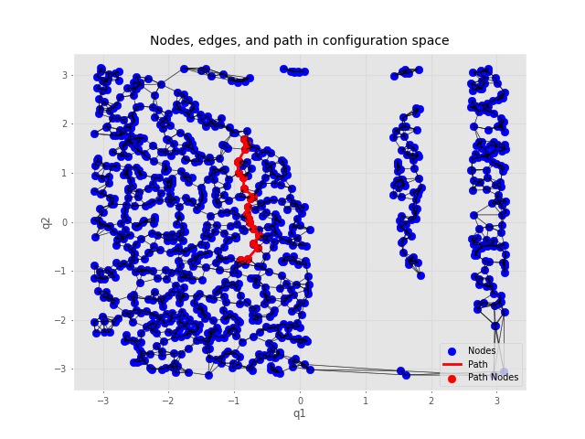

# Probabilistic Roadmap (PRM) Path Planning

This project implements a **Probabilistic Roadmap (PRM)** for robot path planning in environments with obstacles. The PRM uses random sampling to generate nodes in the robot's configuration space and performs collision-free pathfinding using the **A*** algorithm. It was a small educational project for myself, but I am happy if it helps someone else as well.

## Features

- **A-star Pathfinding**: Find the shortest path between start and goal nodes.
- **Graph Visualization**: Visualize the PRM graph and the computed path for 2-DOF robots.
- **Simulation**: Simulate the robot moving along the computed path in a 3D environment.
- **Parallel Edge Checking**: Relatively efficient collision detection along edges using multiprocessing (given the speed limitations due to slow collision check calls).


## Requirements
The project dependencies are listed in the `requirements.txt` file. To install the required packages, run the following command (preferably in a virtual environment):

```bash
pip install -r requirements.txt
```

## Usage
The project example with default arguments can be run using the following command:
```bash
python prm.py
```
For more information on the available options, run:
```bash
python prm.py --help
```

## Examples
Below is an example of the PRM path planning for a 2-DOF robot in a 2D environment. The PRM graph is visualized with the computed path from the start to the goal node.
